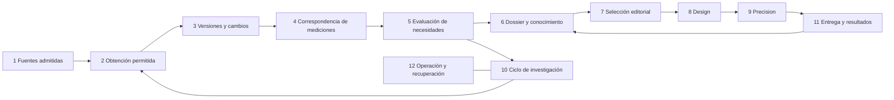

# Telecare OS — arquitectura de las doce aristas v0.1

Fecha: 2026-10-01. Estado: CANDIDATE / MAR REQUIRED.
Alcance ejecutable: LABORATORY_INTERNAL_SUPERVISED.
Base examinada: `0f2770292350c6fe79a387993f7677b82b45f15e`, CI PR
`36948909440` y push `36948904219` exitosos. Autor: agente de implementación;
confianza B para los mecanismos locales probados, sin aceptación independiente.

## Contextos y dependencias

Los cuatro bloques conservan la propiedad definida en
`telecare_context_map_v0.2.md`. Esta propuesta compone sus mecanismos; cualquier
aceptación compartida sigue el MAR abierto. No reemplaza contratos existentes.

La flecha 10→2 sólo examina fuentes ya admitidas dentro del laboratorio. La
flecha 11→6 exige un recibo del efecto realmente observado para aprendizaje de
entrega; un borrador o una lectura local no satisface M08.

## Contratos, propietarios y criterio de cierre

| Arista | Propietario y módulos | Entrada → salida | Cierre ejecutable y límite actual |
| --- | --- | --- | --- |
| 1 Fuentes | B1 `source_control_store`, `source_gateway`, `source_portfolio` | aprobación/binding con alcance, derechos, hash y expiración → fuente admisible | Rechazar fuente propuesta, host/dataset no ligado, licencia ausente o binding caducado. Eurostat/HN son las rutas locales; las 18 candidatas del registro necesitan aprobación propia. |
| 2 Obtención | B4 `local_worker`, `operations.scan_inbox`; B1 adaptadores por fuente | archivo estable hash-bound → entrada retenida | Dos observaciones estables, límite de bytes, identidad de fuente, rechazo de cambio de bytes/replay. Obtener por red requiere un contrato de acceso aprobado; la capacidad local no autoriza otro adaptador. |
| 3 Versiones | B1 `eurostat_maritime_delta`, `manual_watchlist_cycle`, `hn_customs_pipeline` | versiones retenidas → cambio/no cambio/revisión insuficiente | Conservar padres, periodos y procedencia; cambio literal separado de revisión o cambio de cobertura. La causa exige metadatos de la fuente. |
| 4 Correspondencia | B1 `evidence_comparison` | dos dossiers actuales → pares de métrica/unidad/lugar/periodo y discrepancias | No convertir raíces distintas o valores iguales en corroboración. Conservar cobertura de ambos lados. El catálogo actual no tiene una segunda raíz con la misma medición. |
| 5 Necesidades | B1 `need_classification`, `need_assessment` | necesidad exacta y comparación → insuficiencia/discrepancia/revisión y próximo dato | Conservar razón, IDs y frontera de resolución. `RESOLVED` requiere semántica de aceptación por necesidad, evidencia adecuada y revisión autorizada; el candidato actual sólo hace triaje. |
| 6 Intelligence | B1 E01–E08, `intelligence_dossier`, `dossier_editorial_bridge` | evidencia válida y evaluación → hechos/interpretaciones/hipótesis/límites separados | No derivar causalidad de un delta. Las interpretaciones deben referenciar evidencia y alternativas refutables; los dossiers operativos actuales abstienen interpretación. |
| 7 Editorial | B1 `editorial`, `dossier_editorial_bridge` | dossier trazable → shortlist/selección/abstención | Elegibilidad, calidad y pertinencia por casos de referencia aceptados; los dossiers no interpretados permanecen `RESEARCH_NEEDED`. |
| 8 Design | B2 `design_artifact`, E01–E08 y consola | dossier/brief ligados → estructura y render verificables | Mantener hechos y límites, comprobar accesibilidad/render y comprensión con usuarios. El render local está implementado; la calidad con usuarios aún necesita evidencia. |
| 9 Precision | B3 `audience_draft`, M01–M07 y fabric de cuentas | diseño y perfil autorizado → adaptación trazable | Revalidar versión, vigencia y geografía. El perfil declarado está activo; exposición real, datos personales y consentimiento requieren sus entradas autorizadas. |
| 10 Orquestación | B4 `operations`, `research_cycle`, journals | tareas y dossiers actuales → búsqueda local acotada, evaluaciones y espera | Presupuesto, cursor justo, idempotencia, reevaluación ante nuevo material, pausa/STOP, rechazo de caducidad y replay alterado. El nuevo ciclo registra búsquedas sin alterar la autoridad de B1. |
| 11 Entrega/aprendizaje | B3 `delivery`, `learning`; B4 recibos | efecto autorizado observado → resultado medido y aprendizaje candidato | Vincular recibo real a activo, audiencia, canal y fecha; rechazar borrador como entrega. Publicación/contacto/CRM requieren activación propia; no existe entrega externa activa. |
| 12 Operación | B4 `operations_store`, `laboratory_recovery`, lanzador y preflight | versión/configuración/estado → servicio local y recuperación | SHA/CI, claves separadas, respaldo íntegro, restauración pausada, migración reversible, piloto de varios ciclos e identidad del operador. El piloto sintético y recuperación están probados; despliegue sostenido y revisión independiente siguen abiertos. |

## Nuevos mecanismos de este incremento

`research_cycle` pasa de DESIGNED a IMPLEMENTED en este candidato. B4 selecciona
pares tarea/dossier de un inventario local actual, con cantidad limitada por ciclo.
B1 seguirá produciendo comparación y evaluación. B4 conservará el resultado
con identidad determinista y lo revalidará al leer. Una nueva versión genera
una nueva observación; una versión caducada suspende el uso de la anterior.
Los enlaces y decisiones humanas existentes conservan su historia y estado.

## Fallo, recuperación, observabilidad y migración

Un fallo de integridad detiene el proceso según la política vigente. Una fuente
no actual produce una espera específica y permite trabajar sobre otras
fuentes. Evaluación y cabecera se persisten atómicamente antes del cursor: un reinicio puede repetir
el cálculo puro y reutiliza el recibo, sin doble efecto. Los nuevos tipos de
registro caben en el journal HMAC existente y en su respaldo; no hay reescritura
de eventos previos. La lectura revalida autoridad, contenido y vínculos.

Cada resultado conserva tarea, necesidad, dossier(s), hashes/evidence IDs,
hora, clasificación, razón, próximo dato y alcance. El presupuesto es un
parámetro validado del ciclo, no evidencia de capacidad productiva. Métricas de
actividad no se convierten en calidad, verdad o aceptación. Rollback de código
conserva el journal; un consumidor antiguo ignora los registros nuevos y no los
usa como autoridad.

## Validación y decisiones abiertas

Pruebas: progreso positivo del ciclo local, ausencia de candidato, raíces
iguales, fuente/candidato caducados, alteración, cambio durante evaluación,
replay/reinicio, justicia más allá del presupuesto, pausa/STOP, HTTP/UI y
recuperación. Las pruebas positivas de mediciones equivalentes son fixtures
sintéticos; sólo prueban el mecanismo.

MAR debe decidir el lenguaje compartido, semántica de resolución/interpretación,
activación, política de fuente por tipo, presupuestos de producción y custodia
de identidad/claves. Efectos de segundo/tercer orden: más lecturas de almacén y
latencia por ciclo; crecimiento de journal por nuevas combinaciones y eventos de cursor;
mayor superficie de regresión y demanda de revisión ante discrepancias.

Notion `3c789f66-067b-8108-bb44-c13ac4b15ac0` (edición 2026-08-28) conserva
el plan de runtime de referencia; no acepta esta arquitectura de producto.
Slack público no devolvió resultados para Telecare. GitHub liga la evidencia a
SHA; el análisis formal complementario desafía transiciones y presupuesto,
sin convertirse en aceptación. No hay decisión contextual que sustituya MAR.

Wolfram comprobó 26.240 combinaciones de inventario fijo N=1…40,
presupuesto B=1…32 y todos los cursores iniciales: al avanzar min(N,B) por
ciclo se visitan todas las entradas en ceil(N/min(N,B)) ciclos en ejecución.
No prueba justicia bajo inventario cambiante, latencia ni disponibilidad real.

## Resoluciones y límites de la petición «terminar ahora»

La implementación técnica candidata no sustituye los datos ni las decisiones
que necesita el producto. No hay evidencia para llamar completas las doce
aristas: 1–2 necesitan autorización específica para nuevas fuentes/red; 4–7
necesitan evidencia comparable, semántica de resolución e interpretación y
casos editoriales aceptados; 8 necesita evaluación de comprensión con usuarios;
9 datos de cuenta/persona autorizados; 11 permiso, recibos y resultados reales;
12 activación integrada, operación sostenida y revisión independiente.
Propietarios: autoridad de fuentes, arquitectura y negocio según la arista.
El siguiente trabajo seguro es probar la composición local y su recuperación;
las pruebas sintéticas no satisfacen esas decisiones ni sus datos faltantes.
